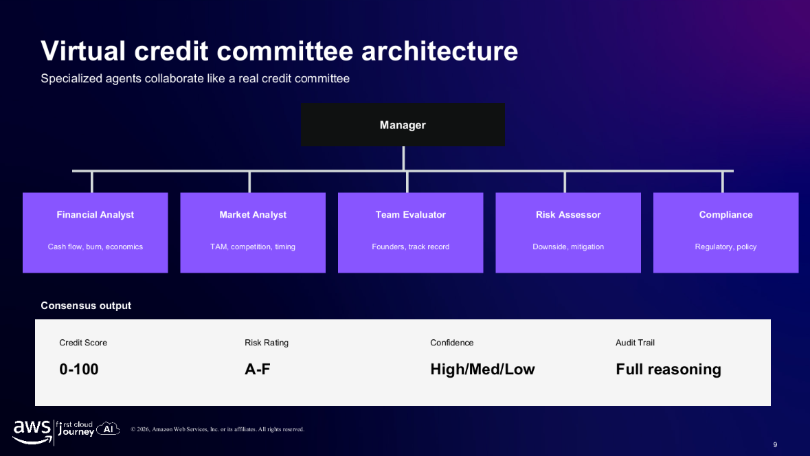
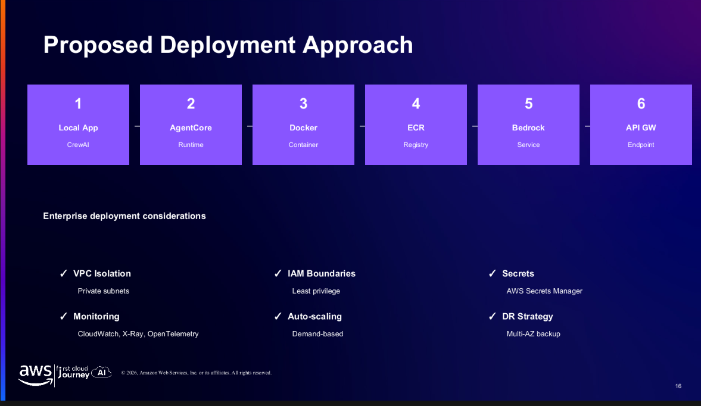
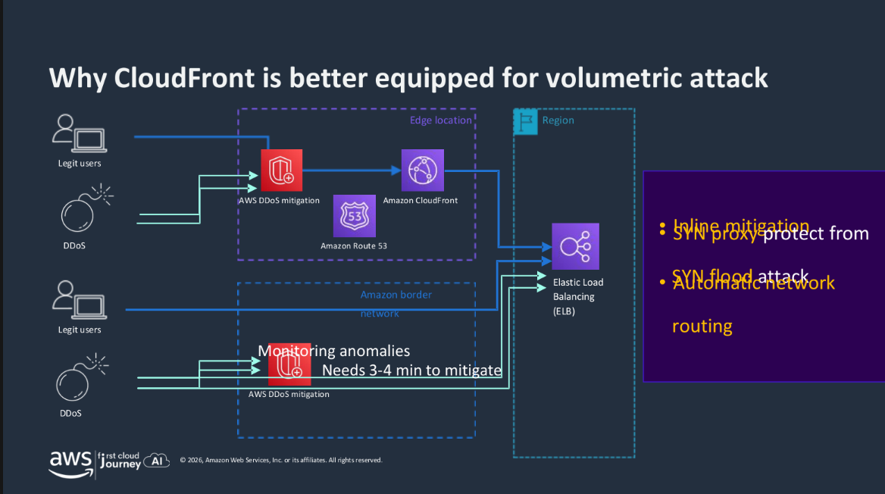
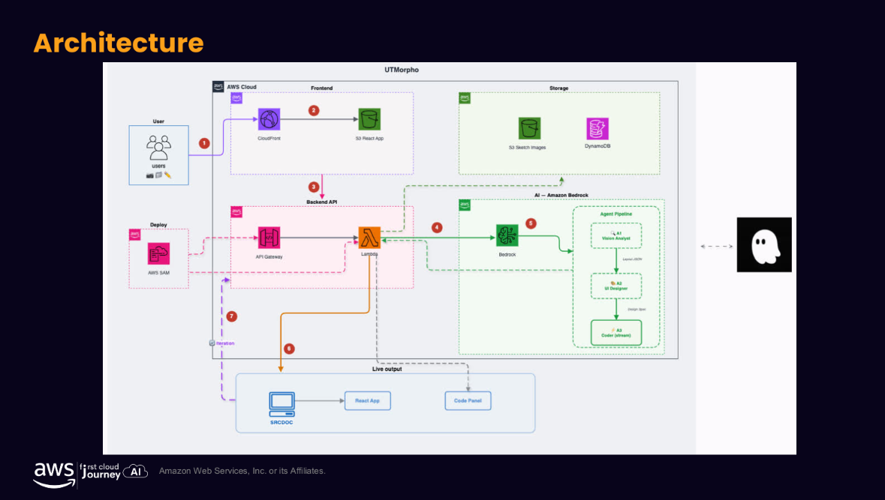
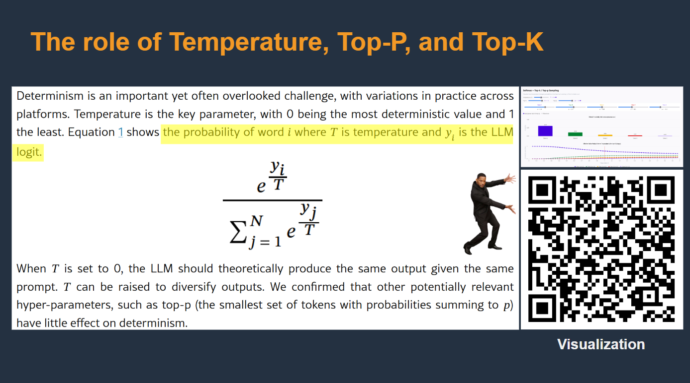

# Event Report: Exploring AI, CloudFront, and Multi-Agent Systems

### 1. Event Significance and Objectives
The event provided practical insights into applying Artificial Intelligence (AI) effectively by establishing the correct context. It also introduced AI tools that streamline data analysis and team collaboration.

Participants gained a deep understanding of Amazon CloudFront—a comprehensive networking platform that helps businesses cut costs while ensuring performance and security. Moreover, the event featured real-world lessons from the UTMorpho project (LotusHacks competition), strategies for handling the instability of large language models (LLMs), and applications of Multi-Agent architectures in credit scoring.

### 2. Program Overview
The agenda focused on analyzing leading technologies within the AWS ecosystem, including GenAI, Multi-Agent Systems, infrastructure security with CloudFront, and operational optimization methods.

**GenAI Applications and Multi-Agent Systems:**
- **Credit Scoring Solution (Vy Lam - VPBank):** Demonstrated how to use the Virtual Credit Committee model (comprising specialized Agents for financial, market, and risk analysis) to evaluate startups lacking collateral. This resulted in a 95% reduction in time and cost, along with doubling the application approval rate.
- **Process Automation (Phạm Ng Hải Anh):** Showcased Amazon Quick Suite to create AI Agents that handle repetitive tasks like summarizing meeting minutes (MoM) and sending automated email notifications.

**AI Deployment Techniques:**
- **The Role of Context (Tinh Truong):** AI often yields incorrect results due to missing background information, not because of the model's limitations. Providing focused context is much more effective than feeding it excess, irrelevant data.
- **LLM Non-Determinism (Đức Đào):** Even when Temperature is set to 0, LLM outputs can vary. Therefore, it's recommended to set Temperature to 0.1, apply Majority Voting mechanisms, and enforce standard output formats (like JSON) for maximum system stability.

**Infrastructure Security with Amazon CloudFront:**
- AWS introduced fixed-pricing plans for CloudFront, helping companies avoid "billing shock" caused by DDoS attacks or sudden traffic spikes.
- CloudFront offloads CPU work from EC2 servers by handling data compression and TLS security protocols, working alongside a global Edge network to block DDoS attacks remotely.

**UTMorpho Case Study:**
- An AI project that generates UI layouts from descriptive text and allows direct user editing (WYSIWYG). The most valuable lesson was that seamless teamwork and understanding the real-world problem are the deciding factors for creating a successful product in a short time limit (a 36-hour hackathon).

### 3. Key Takeaways

**AI & Infrastructure Perspective:**
- Effective AI usage relies heavily on context, not just prompts. The "Second AI Brain" concept highlights the trend of building personalized, long-term memory for AI.
- LLMs are never perfectly stable; thus, rigorous testing, monitoring, and risk management strategies are necessary before production deployment.
- CDN (CloudFront) is more than a static content delivery tool—it acts as a security shield for the system while optimizing infrastructure costs.

**Product Development Perspective:**
- In product development, clearly defining the problem is more crucial than rushing to write code. Under high-pressure environments (like hackathons), prioritizing core features is essential.

### 4. Practical Application Plan
- Optimize personal AI usage for studying by providing clear context and specific goals rather than simple prompts.
- Build automated AI workflows for personal note-taking and document synthesis.
- Deepen knowledge of Amazon CloudFront configuration for personal web projects to enhance site speed and security.
- Implement cross-validation mechanisms whenever integrating LLMs into practical applications to ensure output accuracy.

### 5. Overall Impressions
The event completely transformed my perspective on using AI. Previously, I thought a clever prompt was enough, but the message "Context is everything" truly awakened me to the importance of background data and context.

Additionally, the practical knowledge about CloudFront infrastructure and the inspiring story from the UTMorpho development team working over just 36 hours gave me the motivation to dive deeper into Cloud Architecture, Multi-Agent Systems, and product development in the future.

#### Real Photos From the Event

_Multi-Agent architecture diagram for credit scoring_

_AgentCore platform deployment model on AWS_

_CloudFront's effective DDoS mitigation mechanism_

_Infrastructure structure of the UTMorpho project_

_Impact of the Temperature parameter on LLM outputs_

> Overall, this was a highly valuable learning experience, providing a comprehensive picture of how to combine AI technology, Cloud infrastructure, and business mindset to solve complex real-world problems.
